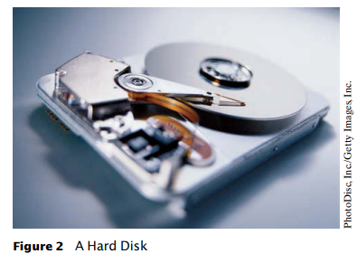
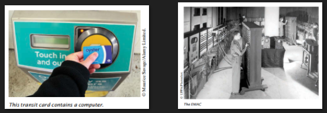
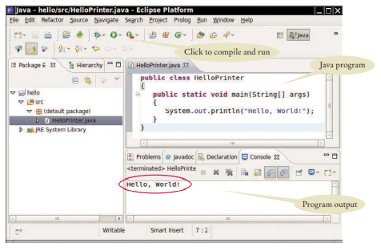
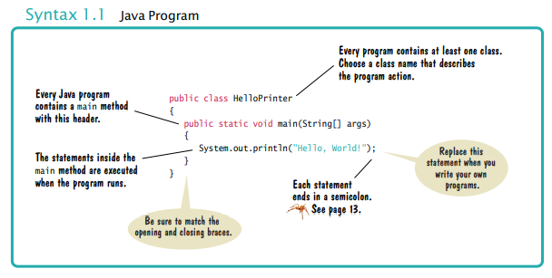
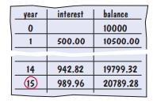
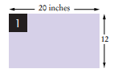
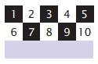
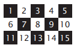

## CHAPTER I.I  Computer Programs
## BAB I Program Komputer

&nbsp
<i align="justify">You have probably used a computer for work or fun. Many people use computers for everyday tasks such as electronic banking or writing a term paper. Computers are good for such tasks. They can handle repetitive chores, such as totaling up numbers or placing words on a page, without getting bored or exhausted.</i>

&nbsp

Anda mungkin pernah menggunakan komputer untuk bekerja atau bersenang-senang. Banyak orang menggunakan komputer untuk 
tugas sehari-hari seperti perbankan elektronik atau menulis makalah. Komputer adalah 
baik untuk tugas-tugas seperti itu. Mereka dapat menangani tugas berulang, seperti menjumlahkan angka 
atau menempatkan kata-kata di halaman, tanpa merasa bosan atau lelah.

&nbsp

&nbsp
<i align="justify">The flexibility of a computer is quite an amazing phenomenon. The same machine 
can balance your checkbook, lay out your term paper, and play a game. In contrast, 
other machines carry out a much narrower range of tasks; a car drives and a toaster 
toasts. Computers can carry out a wide range of tasks because they execute different 
programs, each of which directs the computer to work on a specific task</i>

&nbsp

Fleksibilitas komputer adalah fenomena yang cukup menakjubkan. Mesin yang sama 
dapat menyeimbangkan buku cek Anda, meletakkan kertas istilah Anda, dan bermain game. Sebaliknya, 
mesin lain melakukan berbagai tugas yang jauh lebih sempit; mobil yang dikendarai dan pemanggang roti 
bersulang. Komputer dapat melakukan berbagai tugas karena mereka menjalankan tugas yang berbeda 
program, yang masing-masing mengarahkan komputer untuk bekerja pada tugas tertentu

&nbsp

&nbsp
<i align="justify">The computer itself is a machine that stores data (numbers, words, pictures), inter acts with devices (the monitor, the sound system, the printer), and executes programs. 
A computer program tells a computer, in minute detail, the sequence of steps that 
are needed to fulfill a task. The physical computer and peripheral devices are collec tively called the hardware. The programs the computer executes are called the 
soft ware. </i>

&nbsp

Komputer itu sendiri adalah mesin yang menyimpan data (angka, kata-kata, gambar), berinteraksi dengan perangkat (monitor, sistem suara, printer), dan menjalankan program. 
Sebuah program komputer memberi tahu komputer, secara rinci, urutan langkah-langkah yang 
diperlukan untuk memenuhi tugas. Komputer fisik dan perangkat periferal secara kolektif disebut perangkat keras. Program yang dijalankan komputer disebut 
barang lunak. 

&nbsp

Fleksibilitas komputer adalah fenomena yang cukup menakjubkan. Mesin yang sama 
dapat menyeimbangkan buku cek Anda, meletakkan kertas istilah Anda, dan bermain game. Sebaliknya, 
mesin lain melakukan berbagai tugas yang jauh lebih sempit; mobil yang dikendarai dan pemanggang roti 
bersulang. Komputer dapat melakukan berbagai tugas karena mereka menjalankan tugas yang berbeda 
program, yang masing-masing mengarahkan komputer untuk bekerja pada tugas tertentu

&nbsp

&nbsp
<i align="justify">Today’s computer programs are so sophisticated that it is hard to believe that they 
are composed of extremely primitive instructions. A typical instruction may be one 
of the following:

- Put a red dot at a given screen position.
- Add up two numbers.
- If this value is negative, continue the program at a certain instruction.

The computer user has the illusion of smooth interaction because a program contains 
a huge number of such instructions, and because the computer can execute them at 
great speed.</i>

&nbsp

Program komputer saat ini sangat canggih sehingga sulit dipercaya bahwa mereka
terdiri dari instruksi yang sangat primitif. Instruksi khas mungkin satu
dari berikut ini:

- Letakkan titik merah pada posisi layar tertentu.
- Tambahkan dua angka
- Jika nilai ini negatif, lanjutkan program pada instruksi tertentu.

Pengguna komputer memiliki ilusi interaksi halus karena program berisi
sejumlah besar instruksi tersebut, dan karena komputer dapat mengeksekusi mereka di
kecepatan tinggi.

&nbsp

&nbsp
<i align="justify">The act of designing and implementing computer programs is called programming. In this book, you will learn how to program a computer—that is, how to direct 
the computer to execute tasks.
To write a computer game with motion and sound effects or a word processor 
that supports fancy fonts and pictures is a complex task that requires a team of many 
highly-skilled programmers. Your first programming efforts will be more mundane. 
The concepts and skills you learn in this book form an important foundation, and 
you should not be disappointed if your first programs do not rival the sophisticated 
software that is familiar to you. Actually, you will find that there is an immense thrill 
even in simple programming tasks. It is an amazing experience to see the computer 
precisely and quickly carry out a task that would take you hours of drudgery, to make small changes in a program that lead to immediate improvements, and to see the 
computer become an extension of your mental powers.</i>

&nbsp

Tindakan merancang dan mengimplementasikan program komputer disebut program ming. Dalam buku ini, Anda akan belajar cara memprogram komputer—yaitu, cara mengarahkan 
komputer untuk menjalankan tugas.
Untuk menulis permainan komputer dengan efek gerak dan suara atau pengolah kata 
yang mendukung font dan gambar mewah adalah tugas kompleks yang membutuhkan banyak tim 
programmer yang sangat terampil. Upaya pemrograman pertama Anda akan lebih biasa. 
Konsep dan keterampilan yang Anda pelajari dalam buku ini membentuk fondasi penting, dan 
Anda tidak boleh kecewa jika program pertama Anda tidak menyaingi yang canggih 
perangkat lunak yang akrab bagi anda. Sebenarnya, Anda akan menemukan bahwa ada sensasi besar 
bahkan dalam tugas pemrograman sederhana. Ini adalah pengalaman yang luar biasa untuk melihat komputer 
tepat dan cepat melaksanakan tugas yang akan membawa Anda jam membosankan, untuk membuat perubahan kecil dalam program yang mengarah pada perbaikan segera, dan untuk melihat 
komputer menjadi perpanjangan dari kekuatan mental Anda.

&nbsp

&nbsp
<i align="justify">

1. 1.What is required to play music on a computer? 
2. Why is a CD player less flexible than a computer? 
3. What does a computer user need to know about programming in order to play a 
video game?</i>

&nbsp

1. Apa yang diperlukan untuk memutar musik di komputer?
2. Mengapa Pemutar CD kurang fleksibel daripada komputer?
3. Apa yang perlu diketahui pengguna komputer tentang pemrograman untuk memainkan
video game?

&nbsp

&nbsp

<i align="justify">To understand the programming process, you need to have a rudimentary understanding of the building blocks that make up a computer. We will look at a personal 
computer. Larger computers have faster, larger, or more powerful components, but 
they have fundamentally the same design.
At the heart of the computer lies the central 
processing unit (CPU) (see Figure 1). The inside 
wiring of the CPU is enormously complicated. 
For example, the Intel Core processor (a popular 
CPU for personal computers at the time of this 
writing) is composed of several hundred million 
structural elements, called transistors.
The CPU performs program control and 
data processing. That is, the CPU locates and 
executes the program instructions; it carries out 
arithmetic operations such as addition, subtraction, multiplication, and division; it fetches data 
from external memory or devices and places 
processed data into storage. 
There are two kinds of storage. Primary storage, or memory, is made from electronic circuits that can store data, provided they are 
supplied with electric power. Secondary storage, usually a hard disk (see Figure 2)
or a solid-state drive, provides slower and less expensive storage that persists without </i>

&nbsp

Untuk memahami proses pemrograman, Anda harus memiliki dasar di bawah berdiri dari blok bangunan yang membentuk komputer. Kita akan melihat pribadi
komputer. Komputer yang lebih besar memiliki komponen yang lebih cepat, lebih besar, atau lebih kuat, tetapi
mereka pada dasarnya memiliki desain yang sama.
Di jantung komputer Terletak pusat
unit pengolahan (CPU) (Lihat Gambar 1). The inside
pengkabelan CPU sangat rumit.
Misalnya, prosesor Intel Core (yang populer
CPU untuk komputer pribadi pada saat ini
menulis) terdiri dari beberapa ratus juta
elemen struktural, yang disebut transistor.
CPU melakukan kontrol program dan
pengolahan data. Artinya, CPU menempatkan dan
menjalankan instruksi program; itu melakukan
operasi aritmatika seperti penjumlahan, pengurangan tion, perkalian, dan pembagian; itu mengambil data
dari memori eksternal atau perangkat dan tempat
mengolah data menjadi penyimpanan.
Ada dua jenis penyimpanan. Usia stor primer, atau memori, terbuat dari sirkuit elektronik yang dapat menyimpan data, asalkan mereka
disediakan dengan tenaga listrik. Penyimpanan sekunder, biasanya hard disk (lihat gambar 2)
atau solid-state drive, menyediakan penyimpanan yang lebih lambat dan lebih murah yang bertahan tanpa

<i align="justify">electricity. A hard disk consists of rotating platters, which are coated with a magnetic 
material. A solid-state drive uses electronic components that can retain information 
without power, and without moving parts.
To interact with a human user, a computer requires peripheral devices. The computer transmits information (called output) to the user through a display screen, 
speakers, and printers. The user can enter information (called input) for the computer 
by using a keyboard or a pointing device such as a mouse.
Some computers are self-contained units, whereas others are interconnected 
through networks. Through the network cabling, the computer can read data and 
programs from central storage locations or send data to other computers. To the user 
of a networked computer, it may not even be obvious which data reside on the computer itself and which are transmitted through the network. 
Figure 3 gives a schematic overview of the architecture of a personal computer. 
Program instructions and data (such as text, numbers, audio, or video) reside in secondary storage or elsewhere on the network. When a program is started, its instructions are brought into memory, where the CPU can read them. The CPU reads and 
executes one instruction at a time. As directed by these instructions, the CPU reads 
data, modifies it, and writes it back to memory or secondary storage. Some program 
instructions will cause the CPU to place dots on the display screen or printer or to 
vibrate the speaker. As these actions happen many times over and at great speed, the 
human user will perceive images and sound. Some program instructions read user 
input from the keyboard, mouse, touch sensor, or microphone. The program analyzes the nature of these inputs and then executes the next appropriate instruction</i>

&nbsp

listrik. Sebuah hard disk terdiri dari piring-piring berputar, yang dilapisi dengan magnet 
bahan. Solid-state drive menggunakan komponen elektronik yang dapat menyimpan informasi 
tanpa daya, dan tanpa bagian yang bergerak.
Untuk berinteraksi dengan pengguna manusia, komputer membutuhkan perangkat periferal. Komputer com mentransmisikan informasi (disebut output) kepada pengguna melalui layar tampilan, 
speaker, dan printer. Pengguna dapat memasukkan informasi (disebut input) untuk komputer 
dengan menggunakan keyboard atau perangkat penunjuk seperti mouse.
Beberapa komputer adalah unit mandiri, sedangkan yang lain saling berhubungan 
melalui jaringan. Melalui pengkabelan jaringan, komputer dapat membaca data dan 
program dari lokasi penyimpanan pusat atau mengirim data ke komputer lain. Untuk pengguna 
dari komputer jaringan, bahkan mungkin tidak jelas data mana yang berada di komputer itu sendiri dan yang ditransmisikan melalui jaringan. 
Gambar 3 memberikan gambaran skematis dari arsitektur komputer pribadi. 
Instruksi dan data Program (seperti teks, angka, audio, atau video) berada di sec ondary storage atau di tempat lain di jaringan. Ketika sebuah program dimulai, instruksinya dibawa ke dalam memori, di mana CPU dapat membacanya. CPU membaca dan 
mengeksekusi satu instruksi pada suatu waktu. Seperti yang diarahkan oleh instruksi ini, CPU membaca 
data, memodifikasi, dan menulis kembali ke memori atau penyimpanan sekunder. Beberapa program 
instruksi akan menyebabkan CPU untuk menempatkan titik-titik pada tampilan layar atau printer atau 
getar speaker. Karena tindakan ini terjadi berkali-kali dan dengan kecepatan tinggi, itu 
pengguna manusia akan melihat gambar dan suara. Beberapa instruksi program membaca pengguna 
masukan dari keyboard, mouse, sensor sentuh, atau mikrofon. Program ana lyzes sifat input ini dan kemudian mengeksekusi instruksi yang sesuai berikutnya

&nbsp

&nbsp
<i align="justify">

4. Where is a program stored when it is not currently running?
5. Which part of the computer carries out arithmetic operations, such as addition 
and multiplication?
6. A modern smartphone is a computer, comparable to a desktop computer. Which 
components of a smartphone correspond to those shown in Figure 3?</i>

&nbsp

4. Di mana program disimpan saat tidak sedang berjalan?
5. Bagian mana dari komputer yang melakukan operasi aritmatika, seperti penambahan
dan perkalian?
6. Smartphone modern adalah komputer, sebanding dengan komputer desktop. Yang
komponen smartphone sesuai dengan yang ditunjukkan pada Gambar 3?

&nbsp
<i align="justify">
Practice It Now you can try these exercises at the end of the chapter: R1.2, R1.3.</i>

&nbsp

Berlatih sekarang Anda dapat mencoba latihan ini di akhir bab: R1.2, R1.3.

&nbsp

&nbsp
<i align="justify">When computers were first invented in the 1940s, a computer filled an entire room. The photo below shows the ENIAC (electronic numerical integrator and computer), completed in 1946 at the University of Pennsylvania. The ENIAC was used by the military to compute the trajectories of projectiles. Nowadays, computing facilities of search engines, Internet shops, and social networks fill huge buildings called data centers. At the other end of the spectrum, computers are all around us. Your cell phone has a computer inside, as do many credit cards and fare cards for public transit. A modern car has several computers––to control the engine, brakes, lights, and the radio. The advent of ubiquitous computing changed many aspects of our lives. Factories used to employ people to do repetitive assembly tasks that are today carried out by computercontrolled robots, operated by a few people who know how to work with those computers. Books, music, and movies nowadays are often consumed on computers, and computers are almost always involved in their production. The book that you are reading right now could not have been written without computers. Knowing about computers and how to program them has become an essential skill in many careers. Engineers design computer-controlled cars and medical equipment that preserve lives. Computer scientists develop programs that help people come together to support social causes. For example, activists used social networks to share videos showing abuse by repressive regimes, and this information was instrumental in changing public opinion. As computers, large and small, become ever more embedded in our everyday lives, it is increasingly important for everyone to understand how they work, and how to work with them. As you use this book to learn how to program a computer, you will develop a good understanding of computing fundamentals that will make you a more informed citizen and, perhaps, a computing professional.</i>

&nbsp

Ketika komputer pertama kali ditemukan pada 1940-an, komputer memenuhi seluruh ruangan. Foto di bawah ini menunjukkan ENIAC (electronic numerical inte grator and computer), selesai pada tahun 1946 di University of Pennsylvania. ENIAC digunakan oleh militer untuk menghitung lintasan proyektil. Saat ini, fasilitas komputasi mesin pencari, toko Internet, dan jejaring sosial mengisi gedung-gedung besar yang disebut pusat data. Di ujung lain spektrum, komputer ada di sekitar kita. Ponsel Anda memiliki komputer di dalamnya, seperti halnya banyak kartu kredit dan kartu tarif untuk angkutan umum. Sebuah mobil modern memiliki beberapa komputer - untuk mengontrol mesin, rem, lampu, dan radio. Munculnya ubiqui tous computing mengubah banyak aspek kehidupan kita. Pabrik biasa mempekerjakan orang untuk melakukan tugas perakitan berulang yang saat ini dilakukan oleh robot yang dikendalikan komputer, dioperasikan oleh beberapa orang yang tahu cara bekerja dengan komputer tersebut. Buku, musik, dan film saat ini sering dikonsumsi oleh komputer, dan komputer hampir selalu terlibat dalam produksinya. Buku yang Anda baca sekarang tidak mungkin ditulis tanpa komputer. Mengetahui tentang komputer dan bagaimana program mereka telah menjadi keterampilan penting dalam banyak karir. Insinyur merancang mobil yang dikendalikan komputer dan peralatan medis yang melestarikan kehidupan. Ilmuwan komputer mengembangkan program yang membantu orang berkumpul untuk mendukung tujuan sosial. Misalnya, aktivis menggunakan jejaring sosial untuk berbagi video yang menunjukkan pelecehan oleh rezim yang represif, dan informasi ini berperan penting dalam mengubah opini publik. Sebagai komputer, besar dan kecil, menjadi semakin tertanam dalam kehidupan kita sehari-hari, itu semakin penting bagi setiap orang untuk memahami bagaimana mereka bekerja, dan bagaimana bekerja dengan mereka. Ketika Anda menggunakan buku ini untuk mempelajari cara memprogram komputer, Anda akan mengembangkan pemahaman yang baik tentang dasar-dasar komputasi yang akan membuat Anda menjadi warga negara yang lebih terinformasi dan, mungkin, seorang profesional komputasi.

## 1.3 The Java Programming Language

## 1.3 Bahasa Pemrograman Java

&nbsp
<i align="justify">In order to write a computer program, you need to provide a sequence of instructions that the CPU can execute. A computer program consists of a large number of simple CPU instructions, and it is tedious and error-prone to specify them one by one. For that reason, high-level programming languages have been created. In a high-level language, you specify the actions that your program should carry out. A compiler translates the high-level instructions into the more detailed instructions (called machine code)required by the CPU. Many different programming languages have been designed for different purposes. In 1991, a group led by James Gosling and Patrick Naughton at Sun Microsystems designed a programming language, code-named “Green”, for use in consumer devices, such as intelligent television “set-top” boxes. The language was designed to be simple, secure, and usable for many different processor types. No customer was ever found for this technology. Gosling recounts that in 1994 the team realized, “We could write a really cool browser. It was one of the few things in the client/server mainstream that needed some of the weird things we’d done: architecture neutral, real-time, reliable, secure.” Java was introduced to an enthusiastic crowd at the SunWorld exhibition in 1995, together with a browser that ran applets—Java code that can be located anywhere on the Internet. The figure at right shows a typical example of an applet. Since then, Java has grown at a phenomenal rate. Programmers have embraced the language because it is easier to use than its closest rival, C++. In addition, Java has a rich library that makes it possible to write portable programs that can bypass proprietary operating systems—a feature that was eagerly sought by those who wanted to be independent of those proprietary systems and was bitterly fought by their vendors. A “micro edition” and an “enterprise edition” of the Java library allow Java programmers to target hardware ranging from smart cards to the largest Internet servers. Because Java was designed for the Internet, it has two attributes that make it very suitable for beginners: safety and portability.</i>

Untuk menulis program komputer, Anda perlu memberikan urutan instruksi yang dapat dijalankan CPU. Sebuah program komputer terdiri dari sejumlah besar instruksi CPU sederhana, dan itu membosankan dan rawan kesalahan untuk menentukan mereka satu per satu. Untuk alasan itu, bahasa pemrograman tingkat tinggi telah dibuat. Dalam bahasa tingkat tinggi, Anda menentukan tindakan yang harus dilakukan program Anda. Kompiler menerjemahkan instruksi tingkat tinggi ke dalam instruksi yang lebih rinci (disebut kode mesin)yang diperlukan oleh CPU. Banyak bahasa pemrograman yang berbeda telah dirancang untuk tujuan yang berbeda. Pada tahun 1991, sebuah kelompok yang dipimpin oleh James Gosling dan Patrick Naughton di Sun Microsystems merancang bahasa pemrograman, kode-bernama "hijau", untuk digunakan dalam perangkat konsumen, seperti televisi cerdas "set-top" kotak. Bahasa ini dirancang agar sederhana, aman, dan dapat digunakan untuk berbagai jenis prosesor. Tidak ada pelanggan yang pernah ditemukan untuk teknologi ini. Gosling menceritakan bahwa pada tahun 1994 tim menyadari, "kita bisa menulis browser yang sangat keren. Itu adalah salah satu dari sedikit hal dalam arus utama klien/server yang membutuhkan beberapa hal aneh yang telah kami lakukan: arsitektur netral, real-time, andal, aman."Java diperkenalkan kepada kerumunan yang antusias di pameran SunWorld pada tahun 1995, bersama dengan browser yang menjalankan applet—kode Java yang dapat ditemukan di mana saja di Internet. Gambar di sebelah kanan menunjukkan contoh khas applet. Sejak itu, Jawa telah tumbuh pada tingkat yang fenomenal. Programmer telah memeluk Bahasa karena lebih mudah digunakan daripada saingan terdekatnya, C++. Selain itu, Java memiliki perpustakaan yang kaya yang memungkinkan untuk menulis program portabel yang dapat melewati sistem operasi berpemilik—fitur yang sangat dicari oleh mereka yang ingin independen dari sistem berpemilik tersebut dan diperjuangkan dengan sengit oleh vendor mereka. Sebuah "micro edi tion "dan" Enterprise edition " dari perpustakaan Java memungkinkan programmer Java untuk menargetkan hardware mulai dari smart Card ke server internet terbesar. Karena Java dirancang untuk Internet, ia memiliki dua atribut yang membuatnya sangat cocok untuk pemula: keamanan dan portabilitas.

## 1.4 Becoming Familiar with Your Programming Environment

## 1.4 menjadi akrab dengan lingkungan pemrograman Anda

&nbsp
<i align="justify">Java was designed so that anyone can execute programs in their browser without 
fear. The safety features of the Java language ensure that a program is terminated if it 
tries to do something unsafe. Having a safe environment is also helpful for anyone 
learning Java. When you make an error that results in unsafe behavior, your program 
is terminated and you receive an accurate error report. 
The other benefit of Java is portability. The same Java program will run, without 
change, on Windows, UNIX, Linux, or Macintosh. In order to achieve portability, 
the Java compiler does not translate Java programs directly into CPU instructions. 
Instead, compiled Java programs contain instructions for the Java virtual machine, 
a program that simulates a real CPU. Portability is another benefit for the beginning 
student. You do not have to learn how to write programs for different platforms.
At this time, Java is firmly established as one of the most important languages for 
general-purpose programming as well as for computer science instruction. However, 
although Java is a good language for beginners, it is not perfect, for three reasons.
Because Java was not specifically designed for students, no thought was given to
making it really simple to write basic programs. A certain amount of technical machinery is necessary to write even the simplest programs. This is not a problem for professional programmers, but it can be a nuisance for beginning students. As you learn 
how to program in Java, there will be times when you will be asked to be satisfied with 
a preliminary explanation and wait for more complete detail in a later chapter.
Java has been extended many times during its life—see Table 1. In this book, we 
assume that you have Java version 7 or later.
Finally, you cannot hope to learn all of Java in one course. The Java language itself 
is relatively simple, but Java contains a vast set of library packages that are required 
to write useful programs. There are packages for graphics, user-interface design, 
cryptography, networking, sound, database storage, and many other purposes. Even 
expert Java programmers cannot hope to know the contents of all of the packages—
they just use those that they need for particular projects. 
Using this book, you should expect to learn a good deal about the Java language 
and about the most important packages. Keep in mind that the central goal of this 
book is not to make you memorize Java minutiae, but to teach you how to think 
about programming.</i>

&nbsp

Java dirancang sehingga siapa pun dapat menjalankan program di browser mereka tanpa
takut. Fitur keamanan dari bahasa Java memastikan bahwa program dihentikan jika
mencoba melakukan sesuatu yang tidak aman. Memiliki lingkungan yang aman juga bermanfaat bagi siapa saja
belajar Java. Ketika Anda membuat kesalahan yang mengakibatkan perilaku tidak aman, program Anda
dihentikan dan Anda menerima laporan kesalahan yang akurat.
Manfaat lain dari Java adalah portabilitas. Program Java yang sama akan berjalan, tanpa
perubahan, pada Windows, UNIX, Linux, atau Macintosh. Untuk mencapai portabilitas,
kompiler Java tidak menerjemahkan program Java langsung ke instruksi CPU.
Sebagai gantinya, program java yang dikompilasi berisi instruksi untuk mesin virtual Java,
sebuah program yang mensimulasikan CPU nyata. Portabilitas adalah manfaat lain untuk awal
mahasiswa. Anda tidak harus belajar bagaimana menulis program untuk platform yang berbeda.
Pada saat ini, Java mapan sebagai salah satu bahasa yang paling penting untuk
pemrograman tujuan umum serta untuk instruksi ilmu komputer. Namun,
meskipun Java adalah bahasa yang baik untuk pemula, itu tidak sempurna, karena tiga alasan.
Karena Java tidak dirancang khusus untuk siswa, tidak ada pemikiran yang diberikan kepada
membuatnya sangat sederhana untuk menulis program dasar. Sejumlah mesin teknis diperlukan untuk menulis bahkan program yang paling sederhana sekalipun. Ini bukan masalah bagi programmer profesional, tetapi bisa menjadi gangguan bagi siswa pemula. Saat Anda belajar
bagaimana program di Jawa, akan ada saat-saat ketika Anda akan diminta untuk menjadi puas dengan
penjelasan awal dan tunggu detail yang lebih lengkap di bab selanjutnya.
Java telah diperpanjang berkali—kali selama hidupnya-lihat Tabel 1. Dalam buku ini, kita
asumsikan bahwa Anda memiliki Java Versi 7 atau yang lebih baru.
Akhirnya, Anda tidak bisa berharap untuk mempelajari semua Java dalam satu kursus. Bahasa Jawa sendiri
relatif sederhana, tetapi Java berisi satu set besar paket perpustakaan yang diperlukan
untuk menulis program yang bermanfaat. Ada paket untuk grafis, desain antarmuka pengguna,
kriptografi, jaringan, suara, penyimpanan basis data, dan banyak tujuan lainnya. Bahkan
programmer Java ahli tidak bisa berharap untuk mengetahui isi dari semua paket—
mereka hanya menggunakan yang mereka butuhkan untuk proyek tertentu.
Menggunakan buku ini, Anda harus berharap untuk belajar banyak tentang Bahasa Jawa
dan tentang paket yang paling penting. Perlu diingat bahwa tujuan utama dari ini
buku ini tidak membuat Anda menghafal Java hal-hal kecil, tetapi untuk mengajarkan Anda bagaimana untuk berpikir
tentang pemrograman.

&nbsp

&nbsp
<i align="justify">

7. What are the two most important benefits of the Java language? 
8. How long does it take to learn the entire Java library?</i>

&nbsp

7. Apa dua manfaat terpenting dari bahasa Jawa? 
8. Berapa lama waktu yang dibutuhkan untuk mempelajari seluruh perpustakaan Java?

## 1.4 Becoming Familiar with Your Programming Environment

&nbsp

&nbsp
<i align="justify">Many students find that the tools they need as programmers are very different from 
the software with which they are familiar. You should spend some time making yourself familiar with your programming environment. Because computer systems vary 
widely, this book can only give an outline of the steps you need to follow. It is a good 
idea to participate in a hands-on lab, or to ask a knowledgeable friend to give you a tour.</i>

&nbsp

Banyak siswa menemukan bahwa alat yang mereka butuhkan sebagai programmer sangat berbeda dari 
perangkat lunak yang mereka kenal. Anda harus meluangkan waktu untuk membuat diri Anda terbiasa dengan lingkungan pemrograman Anda. Karena sistem komputer bervariasi 
secara luas, buku ini hanya dapat memberikan garis besar langkah-langkah yang perlu Anda ikuti. Ini adalah baik 
ide untuk berpartisipasi dalam tangan-laboratorium, atau untuk meminta seorang teman berpengetahuan untuk memberikan tur.

&nbsp

&nbsp
<i align="justify">Step 1 Figure 4 Running the HelloPrinter Program in an Integrated Development Environment Java program Program output Click to compile and run Start the Java development environment. Computer systems differ greatly in this regard. On many computers there is an integrated development environment in which you can write and test your programs. On other computers you first launch an editor, a program that functions like a word processor, in which you can enter your Java instructions; you then open a console window and type commands to execute your program. You need to find out how to get started with your environment. Step 2 Write a simple program. The traditional choice for the very first program in a new programming language is a program that displays a simple greeting: “Hello, World!”. Let us follow that tradition. Here is the “Hello, World!” program in Java

    public class HelloPrinter
    {
        public static void main(String[] args)
        { 
        System.out.println("Hello, World!");
        }
    }

We will examine this program in the next section. 
No matter which programming environment you use, you begin your activity by 
typing the program statements into an editor window. 
Create a new file and call it HelloPrinter.java, using the steps that are appropriate 
for your environment. (If your environment requires that you supply a project name 
in addition to the file name, use the name hello for the project.) Enter the program 
instructions exactly as they are given above. Alternatively, locate the electronic copy 
in this book’s companion code and paste it into your editor
</i>

&nbsp

Langkah 1 Gambar 4 menjalankan program HelloPrinter dalam lingkungan pengembangan terpadu Java program program output klik untuk mengkompilasi dan menjalankan mulai Java development environment. Sistem komputer sangat berbeda dalam hal ini. Pada banyak komputer ada lingkungan pengembangan parut inte di mana Anda dapat menulis dan menguji program Anda. Di komputer lain Anda pertama kali meluncurkan editor, program yang berfungsi seperti pengolah kata, di mana Anda dapat memasukkan instruksi Java Anda; Anda kemudian membuka jendela konsol dan mengetik perintah untuk menjalankan program Anda. Anda perlu mencari tahu bagaimana memulai dengan lingkungan Anda. Langkah 2 Tulis program sederhana. Pilihan tradisional untuk program pertama dalam bahasa pemrograman baru adalah program yang menampilkan salam sederhana: "Halo, Dunia!”. Mari kita ikuti tradisi itu. Berikut adalah " Halo, Dunia!"program di Java.

    public class HelloPrinter
    {
        public static void main(String[] args)
        { 
        System.out.println("Hello, World!");
        }
    }

Kami akan memeriksa program ini di bagian selanjutnya. 
Apa pun lingkungan pemrograman yang Anda gunakan, Anda memulai aktivitas Anda dengan 
mengetik pernyataan program ke jendela editor. 
Buat file baru dan sebut saja HelloPrinter.java, menggunakan langkah-langkah yang sesuai 
untuk lingkungan Anda. (Jika lingkungan Anda mengharuskan Anda memberikan nama proyek 
selain nama file, Gunakan nama Halo untuk proyek.) Masuk ke program 
instruksi persis seperti yang diberikan di atas. Atau, cari salinan elektronik 
dalam kode pendamping buku ini dan paste ke editor Anda

&nbsp

&nbsp
<i align="justify">As you write this program, pay careful attention to the various symbols, and keep 
in mind that Java is case sensitive. You must enter upper- and lowercase letters exactly 
as they appear in the program listing. You cannot type MAIN or PrintLn. If you are not 
careful, you will run into problems—see Common Error 1.2 on page 15. 
Step 3 Run the program.
The process for running a program depends greatly on your programming environment. You may have to click a button or enter some commands. When you run the 
test program, the message
Hello, World!
will appear somewhere on the screen (see Figures 4 and 5).
In order to run your program, the Java compiler translates your source files (that 
is, the statements that you wrote) into class files. (A class file contains instructions for 
the Java virtual machine.) After the compiler has translated your source code into 
virtual machine instructions, the virtual machine executes them. During execution, 
the virtual machine accesses a library of pre-written code, including the implementations of the System and PrintStream classes that are necessary for displaying the program’s output. Figure 6 summarizes the process of creating and running a Java program. In some programming environments, the compiler and virtual machine are 
essentially invisible to the programmer—they are automatically executed whenever 
you ask to run a Java program. In other environments, you need to launch the compiler and virtual machine explicitly. 
Step 4 Organize your work.
As a programmer, you write programs, try them out, and improve them. You store 
your programs in files. Files are stored in folders or directories. A folder can contain </i>

&nbsp

Ketika Anda menulis program ini, memperhatikan berbagai simbol, dan menjaga 
Java adalah case sensitive. Anda harus memasukkan huruf besar dan huruf kecil persis 
seperti yang muncul dalam daftar program. Anda tidak dapat mengetik MAIN atau PrintLn. Jika Anda tidak 
hati—hati, Anda akan mengalami masalah-lihat Kesalahan Umum 1.2 di halaman 15. 
Langkah 3 Jalankan program.
Proses untuk menjalankan program sangat tergantung pada lingkungan pemrograman Anda. Anda mungkin harus mengklik tombol atau memasukkan beberapa perintah. Ketika Anda menjalankan 
program uji, pesan
Halo, Dunia!
akan muncul di suatu tempat di layar (Lihat Gambar 4 dan 5).
Untuk menjalankan program Anda, kompiler Java menerjemahkan file sumber Anda (itu 
adalah, pernyataan yang Anda tulis) ke dalam file kelas. (File kelas berisi instruksi untuk 
menggunakan Java virtual machine.) Setelah kompiler menerjemahkan kode sumber Anda ke dalam 
instruksi mesin virtual, mesin virtual mengeksekusinya. Selama eksekusi, 
mesin virtual mengakses perpustakaan pra-ditulis kode, termasuk implementa tions dari sistem dan PrintStream kelas yang diperlukan untuk menampilkan output pro gram. Gambar 6 merangkum proses pembuatan dan menjalankan Java pro gram. Dalam beberapa lingkungan pemrograman, kompiler dan mesin virtual adalah 
pada dasarnya tidak terlihat oleh programmer—mereka secara otomatis dieksekusi setiap kali 
Anda meminta untuk menjalankan program Java. Di lingkungan lain, Anda perlu meluncurkan com piler dan mesin virtual secara eksplisit. 
Langkah 4 Mengatur pekerjaan Anda.
Sebagai seorang programmer, Anda menulis program, mencobanya, dan memperbaikinya. Anda menyimpan 
program Anda dalam file. File disimpan dalam folder atau direktori. Folder dapat berisi

&nbsp

&nbsp
<i align="justify">files as well as other folders, which themselves can contain more files and folders (see 
Figure 7). This hierarchy can be quite large, and you need not be concerned with all of 
its branches. However, you should create folders for organizing your work. It is a 
good idea to make a separate folder for your programming coursework. Inside that 
folder, make a separate folder for each program.
Some programming environments place your programs into a default location if 
you don’t specify a folder yourself. In that case, you need to find out where those files 
are located. 
Be sure that you understand where your files are located in the folder hierarchy. 
This information is essential when you submit files for grading, and for making 
backup copies (see Programming Tip 1.1)</i>

&nbsp

file serta folder lain, yang sendiri dapat berisi lebih banyak file dan folder (lihat 
Gambar 7). Hirarki ini bisa sangat besar, dan Anda tidak perlu khawatir dengan semua 
cabang-cabangnya. Namun, Anda harus membuat folder untuk mengatur pekerjaan Anda. Ini adalah 
ide bagus untuk membuat folder terpisah untuk kursus pemrograman Anda. Di dalam itu 
folder, Buat folder terpisah untuk setiap program.
Beberapa lingkungan pemrograman menempatkan program Anda ke lokasi default jika 
Anda tidak menentukan folder sendiri. Dalam hal ini, Anda perlu mencari tahu di mana file-file 
berada. 
Pastikan Anda memahami di mana file Anda berada dalam hierarki folder. 
Informasi ini sangat penting ketika anda mengirimkan file untuk grading, dan untuk membuat 
salinan cadangan (Lihat tip pemrograman 1.1)

&nbsp
<i align="justify">

9. Where is the HelloPrinter.java file stored on your computer? 
10. What do you do to protect yourself from data loss when you work on programming projects?</i>

&nbsp

9. Dimana HelloPrinter.file java disimpan di komputer Anda? 
10. Apa yang Anda lakukan untuk melindungi diri dari kehilangan data saat Anda mengerjakan proyek program ming?

## Programming Tip 1.1 

## Tip Pemrograman 1.1

&nbsp

&nbsp
<i align="justify">You will spend many hours creating and improving Java programs. It is 
easy to delete a file by accident, and occasionally files are lost because 
of a computer malfunction. Retyping the contents of lost files is frustrating and time-consuming. It is therefore crucially important that 
you learn how to safeguard files and get in the habit of doing so before
disaster strikes. Backing up files on a memory stick is an easy and convenient storage method 
for many people. Another increasingly popular form of backup is Internet file storage. Here 
are a few pointers to keep in mind:
• Back up often. Backing up a file takes only a few seconds, and 
you will hate yourself if you have to spend many hours 
recreating work that you could have saved easily. I recommend 
that you back up your work once every thirty minutes.
• Rotate backups. Use more than one directory for backups, and rotate them. That is, first 
back up onto the first directory. Then back up onto the second directory. Then use the 
third, and then go back to the first. That way you always have three recent backups. If 
your recent changes made matters worse, you can then go back to the older version. 
• Pay attention to the backup direction. Backing up involves copying files from one place to 
another. It is important that you do this right—that is, copy from your work location to 
the backup location. If you do it the wrong way, you will overwrite a newer file with an 
older version.
• Check your backups once in a while. Double-check that your backups are where you think 
they are. There is nothing more frustrating than to find out that the backups are not there 
when you need them. 
• Relax, then restore. When you lose a file and need to restore it from a backup, you are 
likely to be in an unhappy, nervous state. Take a deep breath and think through the 
recovery process before you start. It is not uncommon for an agitated computer user to 
wipe out the last backup when trying to restore a damaged file.</i>

&nbsp

Anda akan menghabiskan berjam-jam membuat dan meningkatkan program Java. Ini adalah
mudah untuk menghapus file secara tidak sengaja, dan kadang-kadang file hilang karena
dari kerusakan Komputer. Mengetik ulang isi file yang hilang adalah frus trating dan memakan waktu. Oleh karena itu sangat penting bahwa
Anda belajar bagaimana untuk menjaga file dan mendapatkan dalam kebiasaan melakukannya sebelum
bencana terjadi. Mencadangkan file pada stik memori adalah metode penyimpanan yang mudah dan nyaman
bagi banyak orang. Bentuk cadangan lain yang semakin populer adalah Penyimpanan File Internet. Di sini
adalah beberapa petunjuk yang perlu diingat:
* Back up sering • Membuat cadangan file hanya membutuhkan beberapa detik, dan
Anda akan membenci diri sendiri jika Anda harus menghabiskan berjam-jam
menciptakan kembali pekerjaan yang bisa Anda simpan dengan mudah. Saya sarankan
bahwa Anda membuat cadangan pekerjaan Anda sekali setiap tiga puluh menit.
* Putar backup. Gunakan lebih dari satu direktori untuk backup, dan memutar mereka. Artinya, pertama
kembali ke direktori pertama. Kemudian kembali ke direktori kedua. Kemudian gunakan
ketiga, dan kemudian kembali ke yang pertama. Dengan begitu Anda selalu memiliki tiga cadangan terbaru. Jika
perubahan terbaru Anda memperburuk keadaan, Anda kemudian dapat kembali ke versi yang lebih lama.
* Perhatikan arah cadangan. Back up melibatkan menyalin file dari satu tempat ke
lain. Penting bagi Anda untuk melakukan ini dengan benar - yaitu, menyalin dari lokasi kerja Anda ke
lokasi cadangan. Jika Anda melakukannya dengan cara yang salah, Anda akan menimpa file yang lebih baru dengan
versi yang lebih lama.
* Periksa backup Anda sesekali. Periksa kembali apakah cadangan Anda berada di tempat yang Anda pikirkan
mereka. Tidak ada yang lebih membuat frustrasi daripada mengetahui bahwa cadangan tidak ada
saat Anda membutuhkannya.
* Santai, lalu pulihkan. Ketika Anda kehilangan file dan perlu mengembalikannya dari cadangan, Anda
mungkin dalam keadaan tidak bahagia dan gugup. Ambil napas dalam-dalam dan berpikir melalui
proses pemulihan sebelum Anda mulai. Hal ini tidak biasa bagi pengguna komputer gelisah untuk
hapus cadangan terakhir saat mencoba memulihkan file yang rusak.

## 1.5 Analyzing Your First Program

## 1.5 Menganalisis Program Pertama Anda

&nbsp

&nbsp

&nbsp
<i align="justify">The line
public class HelloPrinter
indicates the declaration of a class called HelloPrinter. 
Every Java program consists of one or more classes. We will discuss classes in more 
detail in Chapters 2 and 3.
The word public denotes that the class is usable by the “public”. You will later 
encounter private features.
In Java, every source file can contain at most one public class, and the name of the 
public class must match the name of the file containing the class. For example, the 
class HelloPrinter must be contained in a file named HelloPrinter.java.
The construction

    public static void main(String[] args)
    {
    . . .
    }

declares a method called main. A method contains a collection of programming 
instructions that describe how to carry out a particular task. Every Java application 
must have a main method. Most Java programs contain other methods besides main, 
and you will see in Chapter 3 how to write other methods.
The term static is explained in more detail in Chapter 8, and the meaning of 
String[] args is covered in Chapter 11. At this time, simply consider

    public class ClassName
    { 
    public static void main(String[] args)
    {
    . . .
    }
    }

as a part of the “plumbing” that is required to create a Java program. Our first program has all instructions inside the main method of the class. 
The main method contains one or more instructions called statements. Each statement ends in a semicolon (;). When a program runs, the statements in the main method 
are executed one by one
</i>

&nbsp

The line
HelloPrinter kelas publik
menunjukkan deklarasi kelas yang disebut Hello Printer. 
Setiap Program Java terdiri dari satu atau lebih kelas. Kami akan membahas kelas di lebih 
rinci dalam bab 2 dan 3.
Kata publik menunjukkan bahwa kelas dapat digunakan oleh "publik". Anda nanti akan 
encounter fitur pribadi.
Di Jawa, setiap file sumber dapat berisi paling banyak satu kelas publik, dan nama 
kelas publik harus cocok dengan nama file yang berisi kelas. Sebagai contoh 
kelas HelloPrinter harus terkandung dalam file bernama HelloPrinter.Jawa.
Konstruksi

    public static void main(String[] args)
    {
    . . .
    }
mendeklarasikan metode yang disebut utama. Sebuah metode berisi kumpulan pemrograman 
instruksi yang menjelaskan bagaimana melaksanakan tugas tertentu. Setiap aplikasi Java 
harus memiliki metode utama. Sebagian besar program Java berisi metode lain selain Utama, 
dan Anda akan melihat di Bab 3 Cara Menulis metode lain.
Istilah statis dijelaskan secara lebih rinci dalam Bab 8, dan arti 
String [] args tercakup dalam Bab 11. Pada saat ini, hanya mempertimbangkan

    public class ClassName
    { 
    public static void main(String[] args)
    {
    . . .
    }
    }

sebagai bagian dari "pipa" yang diperlukan untuk membuat program Java. Pro gram pertama kami memiliki semua instruksi di dalam metode utama kelas. 
Metode utama berisi satu atau lebih instruksi yang disebut pernyataan. Setiap ment negara berakhir di titik koma (;). Ketika sebuah program berjalan, pernyataan dalam metode utama 
dieksekusi satu per satu

&nbsp

&nbsp

&nbsp
<i align="justify">In our example program, the main method has a single statement:
System.out.println("Hello, World!");
This statement prints a line of text, namely “Hello, World!”. In this statement, we call
a method which, for reasons that we will not explain here, is specified by the rather 
long name System.out.println.
We do not have to implement this method—the programmers who wrote the Java 
library already did that for us. We simply want the method to perform its intended 
task, namely to print a value.
Whenever you call a method in Java, you need to specify 
1. The method you want to use (in this case, System.out.println).
2. Any values the method needs to carry out its task (in this case, "Hello, World!"). 
The technical term for such a value is an argument. Arguments are enclosed in 
parentheses. Multiple arguments are separated by commas.
A sequence of characters enclosed in quotation marks
"Hello, World!"
is called a string. You must enclose the contents of the string inside quotation marks 
so that the compiler knows you literally mean "Hello, World!". There is a reason for 
this requirement. Suppose you need to print the word main. By enclosing it in quotation marks, "main", the compiler knows you mean the sequence of characters m a i n, 
not the method named main. The rule is simply that you must enclose all text strings 
in quotation marks, so that the compiler considers them plain text and does not try to 
interpret them as program instructions.
You can also print numerical values. For example, the statement
System.out.println(3 + 4);
evaluates the expression 3 + 4 and displays the number 7.

The System.out.println method prints a string or a number and then starts a new 
line. For example, the sequence of statements
System.out.println("Hello");
System.out.println("World!");
prints two lines of text:
Hello
World!

There is a second method, System.out.print, that you can use to print an item without 
starting a new line. For example, the output of the two statements
System.out.print("00");
System.out.println(3 + 4);
is the single line
007</i>

&nbsp

Dalam program contoh kita, metode utama memiliki pernyataan tunggal:
Sistem.keluar.println ("Halo, Dunia!");
Pernyataan ini mencetak baris teks, yaitu " Halo, Dunia!”. Dalam pernyataan ini, kita sebut
sebuah metode yang, untuk alasan yang tidak akan kami jelaskan di sini, ditentukan oleh 
sistem nama panjang.keluar.println.
Kami tidak harus menerapkan metode ini-programmer yang menulis Java 
perpustakaan sudah melakukan itu untuk kita. Kami hanya ingin metode untuk melakukan yang dimaksudkan 
tugas, yaitu mencetak suatu nilai.
Setiap kali Anda memanggil metode di Jawa, Anda perlu menentukan 
1. Metode yang ingin Anda gunakan (dalam hal ini, sistem.keluar.println).
2. Nilai apa pun yang dibutuhkan metode untuk menjalankan tugasnya (dalam hal ini, "Halo, Dunia!"). 
Istilah teknis untuk nilai seperti itu adalah argumen. Argumen terlampir dalam 
tanda kurung. Beberapa argumen dipisahkan dengan koma.
Urutan karakter terlampir dalam tanda kutip
"Halo, Dunia!"
disebut string. Anda harus menyertakan isi string di dalam tanda kutip 
sehingga kompiler tahu Anda secara harfiah berarti " Halo, Dunia!". Ada alasan untuk 
persyaratan ini. Misalkan Anda perlu mencetak kata utama. Dengan melampirkannya dalam tanda kuota," utama", kompiler tahu yang Anda maksud adalah urutan karakter m A I n, 
bukan metode bernama main. Aturannya adalah Anda harus menyertakan semua string teks 
dalam tanda kutip, sehingga compiler menganggap mereka teks biasa dan tidak mencoba untuk 
menafsirkannya sebagai instruksi program.
Anda juga dapat mencetak nilai numerik. Misalnya, pernyataan
Sistem.keluar.println(3 + 4);
mengevaluasi ekspresi 3 + 4 dan menampilkan angka 7.

Sistem.keluar.metode println mencetak string atau nomor dan kemudian mulai Baru 
line. Misalnya, urutan pernyataan
Sistem.keluar.println ("Halo");
Sistem.keluar.println ("dunia!");
mencetak dua baris teks:
Halo
Dunia!

Ada metode kedua, sistem.keluar.cetak, yang dapat Anda gunakan untuk mencetak item tanpa 
memulai baris baru. Sebagai contoh, output dari dua pernyataan
Sistem.keluar.cetak ("00");
Sistem.keluar.println(3 + 4);
adalah garis tunggal
007

11. How do you modify the HelloPrinter program to greet you instead?
12. How would you modify the HelloPrinter program to print the word “Hello” 
vertically?
13. Would the program continue to work if you replaced line 7 with this statement?
System.out.println(Hello); 
14. What does the following set of statements print?
System.out.print("My lucky number is");
System.out.println(3 + 4 + 5);
15. What do the following statements print?
System.out.println("Hello"); 
System.out.println(""); 
System.out.println("World");</i>

&nbsp

11. Bagaimana Anda memodifikasi program HelloPrinter untuk menyambut Anda sebagai gantinya?
12. Bagaimana Anda memodifikasi program HelloPrinter untuk mencetak kata "halo"
vertikal?
13. Apakah program akan terus bekerja jika Anda mengganti baris 7 dengan pernyataan ini?
Sistem.keluar.println (Halo);
14. Apa yang dicetak oleh kumpulan pernyataan berikut?
Sistem.keluar.cetak ("angka keberuntungan saya adalah");
Sistem.keluar.println(3 + 4 + 5);
15. Apa yang dicetak oleh pernyataan berikut?
Sistem.keluar.println ("Halo");
Sistem.keluar.println("");
Sistem.keluar.println ("dunia");

### Omitting Semicolons

## Menghilangkan Titik Koma

&nbsp

&nbsp
<i align="justify">In Java every statement must end in a semicolon. Forgetting to type a semicolon is a common 
error. It confuses the compiler, because the compiler uses the semicolon to find where one 
statement ends and the next one starts. The compiler does not use line breaks or closing braces 
to recognize the end of statements. For example, the compiler considers

    System.out.println("Hello")
    System.out.println("World!");
    a single statement, as if you had written
    System.out.println("Hello") System.out.println("World!");

Then it doesn’t understand that statement, because it does not expect the word System following the closing parenthesis after "Hello". 
The remedy is simple. Scan every statement for a terminating semicolon, just as you would 
check that every English sentence ends in a period. However, do not add a semicolon at the 
end of public class Hello or public static void main. These lines are not statements.
</i>

&nbsp

Di Java setiap pernyataan harus diakhiri dengan titik koma. Lupa mengetik titik koma adalah hal yang umum 
kesalahan. Ini membingungkan compiler, karena compiler menggunakan titik koma untuk menemukan di mana satu 
pernyataan berakhir dan yang berikutnya dimulai. Kompiler tidak menggunakan jeda baris atau kurung tutup 
untuk mengenali akhir Pernyataan. Sebagai contoh, compiler menganggap

    Sistem.keluar.println ("Halo")
    Sistem.keluar.println ("dunia!");
    sebuah pernyataan tunggal, seolah-olah Anda telah menulis
    Sistem.keluar.println ("Halo") sistem.keluar.println ("dunia!");

Maka tidak mengerti pernyataan itu, karena tidak mengharapkan sistem Kata mengikuti tanda kurung tutup setelah "Halo". 
Obatnya sederhana. Memindai setiap pernyataan untuk titik koma mengakhiri, seperti yang Anda lakukan 
periksa apakah setiap kalimat bahasa Inggris berakhir dalam satu titik. Namun, jangan menambahkan titik koma di 
akhir kelas publik Halo atau public static void main. Baris-baris ini bukan pernyataan.

## 1.6 Errors

## 1.6 kesalahan

&nbsp

&nbsp
<i align="justify">Experiment a little with the HelloPrinter program. 
What happens if you make a typing error such as
System.ou.println("Hello, World!");
System.out.println("Hello, Word!");
In the first case, the compiler will complain. It will 
say that it has no clue what you mean by ou. The 
exact wording of the error message is dependent 
on your development environment, but it might be 
something like “Cannot find symbol ou”. This is a 
compile-time error. Something is wrong according to the rules of the language and the compiler 
finds it. For this reason, compile-time errors are 
often called syntax errors. When the compiler 
finds one or more errors, it refuses to translate the program into Java virtual machine 
instructions, and as a consequence you have no program that you can run. You must 
fix the error and compile again. In fact, the compiler is quite picky, and it is common 
to go through several rounds of fixing compile-time errors before compilation succeeds for the first time.
If the compiler finds an error, it will not simply stop and give up. It will try to 
report as many errors as it can find, so you can fix them all at once. 
Sometimes, an error throws the compiler off track. Suppose, for example, you 
forget the quotation marks around a string: System.out.println(Hello, World!). The 
compiler will not complain about the missing quotation marks. Instead, it will report 
“Cannot find symbol Hello”. Unfortunately, the compiler is not very smart and it 
does not realize that you meant to use a string. It is up to you to realize that you need 
to enclose strings in quotation marks. 
The error in the second line above is of a different kind. The program will compile 
and run, but its output will be wrong. It will print
Hello, Word!
This is a run-time error. The program is syntactically correct and does something, 
but it doesn’t do what it is supposed to do. Because run-time errors are caused by 
logical flaws in the program, they are often called logic errors.
This particular run-time error did not include an error message. It simply produced the wrong output. Some kinds of run-time errors are so severe that they generate an exception: an error message from the Java virtual machine. For example, if 
your program includes the statement
System.out.println(1 / 0);
you will get a run-time error message “Division by zero”.
During program development, errors are unavoidable. Once a program is longer 
than a few lines, it would require superhuman concentration to enter it correctly 
without slipping up once. You will find yourself omitting semicolons or quotation 
marks more often than you would like, but the compiler will track down these problems for you.
Run-time errors are more troublesome. The compiler will not find them—in fact, 
the compiler will cheerfully translate any program as long as its syntax is correct but the resulting program will do something wrong. It is the responsibility of the 
program author to test the program and find any run-time errors. </i>

&nbsp

Bereksperimenlah sedikit dengan program HelloPrinter.
Apa yang terjadi jika Anda membuat kesalahan pengetikan seperti
Sistem.ou.println ("Halo, Dunia!");
Sistem.keluar.println ("Halo, kata!");
Dalam kasus pertama, kompiler akan mengeluh. Ini akan
katakan bahwa itu tidak memiliki petunjuk apa yang Anda maksud dengan ou. The
kata-kata yang tepat dari pesan kesalahan tergantung
pada lingkungan pengembangan Anda, tetapi mungkin
sesuatu seperti"tidak dapat menemukan simbol ou". Ini adalah
kesalahan waktu kompilasi. Ada sesuatu yang salah sesuai dengan aturan bahasa dan kompiler
menemukannya. Untuk alasan ini, kesalahan waktu kompilasi adalah
sering disebut kesalahan sintaks. Ketika compiler
menemukan satu atau lebih kesalahan, ia menolak untuk menerjemahkan program ke dalam mesin virtual Java
instruksi, dan sebagai konsekuensinya Anda tidak memiliki program yang dapat anda jalankan. Anda harus
perbaiki kesalahan dan kompilasi lagi. Bahkan, kompiler cukup pilih-pilih, dan itu umum
untuk pergi melalui beberapa putaran memperbaiki kesalahan waktu kompilasi sebelum kompilasi suc ceeds untuk pertama kalinya.
Jika kompiler menemukan kesalahan, itu tidak akan berhenti dan menyerah begitu saja. Ini akan mencoba untuk
laporkan kesalahan sebanyak yang dapat ditemukan, sehingga anda dapat memperbaikinya sekaligus.
Terkadang, kesalahan membuat kompiler keluar jalur. Misalkan, misalnya, Anda
lupakan tanda kutip di sekitar string: sistem.keluar.println (Halo, Dunia!). The
compiler tidak akan mengeluh tentang tanda kutip hilang. Sebaliknya, ia akan melaporkan
"Tidak dapat menemukan simbol Halo". Sayangnya, compiler tidak sangat cerdas dan
tidak menyadari bahwa Anda dimaksudkan untuk menggunakan string. Terserah Anda untuk menyadari bahwa Anda perlu
untuk melampirkan string dalam tanda kutip.
Kesalahan pada baris kedua di atas adalah jenis yang berbeda. Program ini akan mengkompilasi
dan jalankan, tetapi outputnya akan salah. Ini akan mencetak
Halo, Kata!
Ini adalah kesalahan run-time. Program ini secara sintaksis benar dan melakukan sesuatu,
tapi itu tidak melakukan apa yang seharusnya dilakukan. Karena kesalahan run-time disebabkan oleh
kelemahan logis dalam program ini, mereka sering disebut kesalahan logika.
Kesalahan run-time khusus ini tidak menyertakan pesan kesalahan. Ini hanya pro duced output yang salah. Beberapa jenis kesalahan run-time sangat parah sehingga menghasilkan pengecualian: pesan kesalahan dari mesin virtual Java. Misalnya, jika
program Anda termasuk pernyataan
Sistem.keluar.println(1/0);
Anda akan mendapatkan pesan kesalahan run-time "pembagian dengan nol".
Selama pengembangan program, kesalahan tidak dapat dihindari. Setelah program lebih panjang
dari beberapa baris, itu akan membutuhkan konsentrasi manusia super untuk memasukkannya dengan benar
tanpa tergelincir sekali. Anda akan menemukan diri Anda menghilangkan titik koma atau kutipan
menandai lebih sering daripada yang Anda inginkan, tetapi kompiler akan melacak masalah ini untuk anda.
Kesalahan Run-time lebih merepotkan. Kompiler tidak akan menemukannya-sebenarnya,
kompiler akan dengan riang menerjemahkan program apa pun selama sintaksnya benar tetapi program yang dihasilkan akan melakukan sesuatu yang salah. Ini adalah tanggung jawab dari 
Program Penulis untuk menguji program dan menemukan kesalahan runtime.

16. Suppose you omit the "" characters around Hello, World! from the HelloPrinter.
java program. Is this a compile-time error or a run-time error?
17. Suppose you change println to printline in the HelloPrinter.java program. Is this 
a compile-time error or a run-time error?
18. Suppose you change main to hello in the HelloPrinter.java program. Is this a 
compile-time error or a run-time error?
19. When you used your computer, you may have experienced a program that 
“crashed” (quit spontaneously) or “hung” (failed to respond to your input). Is 
that behavior a compile-time error or a run-time error?
20. Why can’t you test a program for run-time errors when it has compiler errors?</i>

&nbsp

16. Misalkan Anda menghilangkan karakter "" di sekitar Halo, Dunia! dari HelloPrinter.
program java. Apakah ini kesalahan waktu kompilasi atau kesalahan runtime?
17. Misalkan Anda mengubah println menjadi print line di HelloPrinter.program java. Apakah ini 
kesalahan waktu kompilasi atau kesalahan runtime?
18. Misalkan Anda mengubah main menjadi hello di HelloPrinter.program java. Apakah ini 
kesalahan waktu kompilasi atau kesalahan runtime?
19. Ketika Anda menggunakan komputer Anda, Anda mungkin pernah mengalami program yang 
"jatuh "(berhenti secara spontan) atau" digantung " (gagal menanggapi masukan Anda). Adalah 
perilaku itu kesalahan waktu kompilasi atau kesalahan runtime?
20. Mengapa Anda tidak dapat menguji program untuk kesalahan run-time ketika memiliki kesalahan kompiler?

### Common Error 1.2

### Kesalahan Umum 1.2

&nbsp

&nbsp
<i align="justify">If you accidentally misspell a word, then strange things may happen, and it may not always be 
completely obvious from the error messages what went wrong. Here is a good example of how 
simple spelling errors can cause trouble:

    public class HelloPrinter
    { 
    public static void Main(String[] args)
    { 
    System.out.println("Hello, World!");
    }
    }

This class declares a method called Main. The compiler will not consider this to be the same as 
the main method, because Main starts with an uppercase letter and the Java language is case sensitive. Upper- and lowercase letters are considered to be completely different from each other, 
and to the compiler Main is no better match for main than rain. The compiler will cheerfully 
compile your Main method, but when the Java virtual machine reads the compiled file, it will 
complain about the missing main method and refuse to run the program. Of course, the message “missing main method” should give you a clue where to look for the error.
If you get an error message that seems to indicate that the compiler or virtual machine is on 
the wrong track, check for spelling and capitalization. If you misspell the name of a symbol 
(for example, ou instead of out), the compiler will produce a message such as “cannot find symbol ou”. That error message is usually a good clue that you made a spelling error
</i>

&nbsp

Jika Anda secara tidak sengaja salah mengeja kata, maka hal-hal aneh mungkin terjadi, dan itu mungkin tidak selalu 
benar-benar jelas dari pesan kesalahan apa yang salah. Berikut adalah contoh yang baik tentang bagaimana 
kesalahan ejaan sederhana dapat menyebabkan masalah:

    public class HelloPrinter
    { 
    public static void Main(String[] args)
    { 
    System.out.println("Hello, World!");
    }
    }

Kelas ini menyatakan metode yang disebut Main. Kompiler tidak akan menganggap ini sama dengan 
metode utama, karena Utama dimulai dengan huruf besar dan bahasa Java adalah case sensitive. Huruf besar dan huruf kecil dianggap sangat berbeda satu sama lain, 
dan untuk kompiler Main tidak lebih cocok untuk main daripada rain. Compiler akan riang 
Kompilasi metode utama Anda, tetapi ketika mesin virtual Java membaca file yang dikompilasi, itu akan 
mengeluh tentang metode utama yang hilang dan menolak untuk menjalankan program. Tentu saja, pesan" metode utama yang hilang " akan memberi Anda petunjuk di mana harus mencari kesalahan.
Jika Anda mendapatkan pesan kesalahan yang tampaknya menunjukkan bahwa kompiler atau mesin virtual aktif 
jalur yang salah, periksa ejaan dan kapitalisasi. Jika Anda salah mengeja nama simbol 
(misalnya, ou bukan out), kompiler akan menghasilkan pesan seperti "tidak dapat menemukan simbol ou". Pesan kesalahan itu biasanya merupakan petunjuk bagus bahwa Anda membuat kesalahan ejaan

## 1.7 Problem Solving: Algorithm Design
### 1.7.1 The Algorithm Concept

## 1.7 Pemecahan Masalah: Desain Algoritma
### 1.7.1 Konsep Algoritma

&nbsp

&nbsp
<i align="justify">You may have run across advertisements that 
encourage you to pay for a computerized service 
that matches you up with a love partner. Think 
how this might work. You fill out a form and send 
it in. Others do the same. The data are processed 
by a computer program. Is it reasonable to assume 
that the computer can perform the task of finding 
the best match for you? Suppose your younger 
brother, not the computer, had all the forms on his 
desk. What instructions could you give him? You 
can’t say, “Find the best-looking person who likes 
inline skating and browsing the Internet”. There 
is no objective standard for good looks, and your 
brother’s opinion (or that of a computer program 
analyzing the photos of prospective partners) will likely be different from yours. If 
you can’t give written instructions for someone to solve the problem, there is no way 
the computer can magically find the right solution. The computer can only do what 
you tell it to do. It just does it faster, without getting bored or exhausted. 
For that reason, a computerized match-making service cannot guarantee to find 
the optimal match for you. Instead, you may be presented with a set of potential partners who share common interests with you. That is a task that a computer program 
can solve. 
In order for a computer program to provide an answer to a problem that computes 
an answer, it must follow a sequence of steps that is

- Unambiguous
- Executable
- Terminating 

The step sequence is unambiguous when there are precise instructions for what to do 
at each step and where to go next. There is no room for guesswork or personal opinion. A step is executable when it can be carried out in practice. For example, a computer can list all people that share your hobbies, but it can’t predict who will be your 
life-long partner. Finally, a sequence of steps is terminating if it will eventually come 
to an end. A program that keeps working without delivering an answer is clearly not 
useful. 
A sequence of steps that is unambiguous, 
executable, and terminating is called an algorithm. 
Although there is no algorithm for finding a partner, many problems do have algorithms for solving 
them. The next section gives an example.</i>

&nbsp

Anda mungkin telah menjalankan seluruh iklan yang 
dorong Anda untuk membayar layanan terkomputerisasi 
yang cocok Anda dengan pasangan cinta. Berpikir 
bagaimana ini bisa bekerja. Anda mengisi formulir dan mengirim 
itu masuk. Yang lain melakukan hal yang sama. Data diproses 
oleh program komputer. Apakah masuk akal untuk berasumsi 
bahwa komputer dapat melakukan tugas mencari 
pertandingan terbaik untuk Anda? Misalkan anda lebih muda 
saudara, bukan komputer, memiliki semua bentuk pada-Nya 
meja. Instruksi apa yang bisa anda berikan padanya? Anda 
tidak bisa mengatakan, " Temukan orang yang paling tampan yang suka 
inline skating dan browsing Internet". Ada 
tidak ada standar obyektif untuk penampilan yang baik, dan Anda 
pendapat saudara (atau dari program komputer 
menganalisis foto-foto calon mitra) kemungkinan akan berbeda dari Anda. Jika 
Anda tidak dapat memberikan instruksi tertulis kepada seseorang untuk menyelesaikan masalah, tidak mungkin 
komputer secara ajaib dapat menemukan solusi yang tepat. Komputer hanya dapat melakukan apa yang 
Anda katakan untuk melakukan. Itu hanya melakukannya lebih cepat, tanpa bosan atau lelah. 
Untuk alasan itu, layanan pembuatan pertandingan terkomputerisasi tidak dapat menjamin untuk menemukan 
pertandingan optimal untuk anda. Sebaliknya, Anda mungkin akan disajikan dengan satu set mitra potensial yang berbagi kepentingan bersama dengan Anda. Itu adalah tugas yang program komputer 
dapat memecahkan. 
Dalam rangka untuk program komputer untuk memberikan jawaban atas masalah yang menghitung 
sebuah jawaban, maka harus mengikuti urutan langkah-langkah yaitu

- Tidak ambigu
- Dapat dieksekusi
- Mengakhiri 

Urutan langkah tidak ambigu ketika ada instruksi yang tepat untuk apa yang harus dilakukan 
pada setiap langkah dan ke mana harus pergi berikutnya. Tidak ada ruang untuk menebak atau pendapat pribadi. Sebuah langkah dapat dieksekusi ketika dapat dilakukan dalam praktik. Misalnya, komputer dapat mencantumkan semua orang yang berbagi hobi Anda, tetapi tidak dapat memprediksi siapa yang akan menjadi hobi Anda 
mitra seumur hidup. Akhirnya, urutan langkah-langkah yang mengakhiri jika akhirnya akan datang 
berakhir. Sebuah program yang terus bekerja tanpa memberikan jawaban jelas tidak 
berguna. 
Urutan langkah-langkah yang tidak ambigu, 
executable, dan mengakhiri disebut algoritma. 
Meskipun tidak ada algoritma untuk menemukan pasangan, banyak masalah memiliki algoritma untuk memecahkan 
mereka. Bagian selanjutnya memberikan contoh.

&nbsp

&nbsp
<i align="justify">Consider the following investment problem:
You put $10,000 into a bank account that earns 5 percent interest per year. How many 
years does it take for the account balance to be double the original?
Could you solve this problem by hand? Sure, you could. You figure out the balance 
as follows:
</i>

<i>
You keep going until the balance is at least $20,000. Then the last number in the year 
column is the answer.
Of course, carrying out this computation is intensely boring to you or your 
younger brother. But computers are very good at carrying out repetitive calculations quickly and flawlessly. What is important to the computer is a description of the 
steps for finding the solution. Each step must be clear and unambiguous, requiring no 
guesswork. Here is such a description:
</i>

&nbsp

Pertimbangkan masalah investasi berikut:
Anda memasukkan $ 10.000 ke rekening bank yang menghasilkan bunga 5 persen per tahun. Berapa banyak
tahun yang dibutuhkan untuk saldo rekening menjadi dua kali lipat asli?
Bisakah Anda memecahkan masalah ini dengan tangan? Tentu, kau bisa. Anda mengetahui keseimbangan
sebagai berikut:

Anda terus berjalan sampai saldo setidaknya $20.000. Kemudian angka terakhir di tahun ini
kolom adalah jawabannya.
Tentu saja, melakukan perhitungan ini sangat membosankan bagi Anda atau Anda
adik laki-laki. Tetapi komputer sangat baik dalam melakukan perhitungan berulang dengan cepat dan sempurna. Yang penting bagi komputer adalah deskripsi dari
langkah-langkah untuk menemukan solusi. Setiap langkah harus jelas dan tidak ambigu, tidak memerlukan
menebak. Berikut adalah deskripsi seperti itu:

### Start with a year value of 0, a column for the interest, and a balance of $10,000.

&nbsp

### Repeat the following steps while the balance is less than $20,000 Add 1 to the year value.  Compute the interest as balance x 0.05 (i.e., 5 percent interest). Add the interest to the balance. 

&nbsp

### Ulangi langkah-langkah berikut sementara saldo kurang dari $ 20.000 tambahkan 1 ke nilai tahun. Hitung bunga sebagai saldo x 0,05 (yaitu bunga 5 persen). Tambahkan bunga ke saldo.

&nbsp

&nbsp

&nbsp
<i align="justify">There are no strict requirements for pseudo code because it is read by human readers, 
not a computer program. Here are the kinds of pseudocode statements and how we 
will use them in this book:
• Use statements such as the following to describe how a value is set or changed: 
total cost = purchase price + operating cost
Multiply the balance value by 1.05.
Remove the first and last character from the word.
• Describe decisions and repetitions as follows: 
If total cost 1 < total cost 2
While the balance is less than $20,000
For each picture in the sequence
Use indentation to indicate which statements should be selected or repeated:
For each car
operating cost = 10 x annual fuel cost
total cost = purchase price + operating cost
Here, the indentation indicates that both statements should be executed for 
each car.
• Indicate results with statements such as:
Choose car1.
Report the final year value as the answer</i>

&nbsp

Tidak ada persyaratan ketat untuk kode semu karena dibaca oleh pembaca manusia,
bukan program komputer. Berikut adalah jenis pernyataan pseudocode dan bagaimana kita
akan menggunakannya dalam buku ini:
* Gunakan pernyataan seperti berikut untuk menggambarkan bagaimana nilai diatur atau diubah:
total biaya = harga pembelian + biaya operasi
Lipat gandakan nilai saldo dengan 1,05.
Hapus karakter pertama dan terakhir dari kata.
* Jelaskan keputusan dan pengulangan sebagai berikut:
Jika total biaya 1 < total Biaya 2
Sementara saldo kurang dari $20.000
Untuk setiap gambar dalam urutan
Gunakan indentasi untuk menunjukkan pernyataan Mana yang harus dipilih atau diulang:
Untuk setiap mobil
biaya operasional = 10 x biaya bahan bakar tahunan
total biaya = harga pembelian + biaya operasi
Di sini, indentasi menunjukkan bahwa kedua pernyataan harus dieksekusi untuk
setiap mobil.
* Menunjukkan hasil dengan pernyataan seperti:
Pilih car1.
Laporkan nilai tahun terakhir sebagai jawabannya

&nbsp

&nbsp
<i align="justify">In Section 1.7.2, we developed pseudocode for finding how long it takes to double an 
investment. Let’s double-check that the pseudocode represents an algorithm; that is, 
that it is unambiguous, executable, and terminating. 
Our pseudocode is unambiguous. It simply tells how to update values in each step. 
The pseudocode is executable because we use a fixed interest rate. Had we said to use 
the actual interest rate that will be charged in years to come, and not a fixed rate of 5 
percent per year, the instructions would not have been executable. There is no way 
for anyone to know what the interest rate will be in the future. It requires a bit of 
thought to see that the steps are terminating: With every step, the balance goes up by 
at least $500, so eventually it must reach $20,000. 
Therefore, we have found an algorithm to solve our investment problem, and 
we know we can find the solution by programming a computer. The existence of 
an algorithm is an essential prerequisite for programming a task. You need to first 
discover and describe an algorithm for the task before you start programming (see 
Figure 8). In the chapters that follow, you will learn how to express algorithms in the 
Java language.</i>

&nbsp

Di bagian 1.7.2, kami mengembangkan pseudocode untuk menemukan berapa lama waktu yang dibutuhkan untuk menggandakan
investasi. Mari kita periksa kembali bahwa pseudocode mewakili algoritma; yaitu,
bahwa itu tidak ambigu, dapat dieksekusi, dan diakhiri.
Pseudocode kami tidak ambigu. Ini hanya memberi tahu cara memperbarui nilai di setiap langkah.
Pseudocode dapat dieksekusi karena kami menggunakan tingkat bunga tetap. Apakah kita mengatakan untuk menggunakan
tingkat bunga aktual yang akan dikenakan di tahun-tahun mendatang, dan bukan tingkat bunga tetap 5
persen per tahun, instruksi tidak akan dieksekusi. Tidak ada cara
bagi siapa saja untuk mengetahui apa tingkat bunga akan di masa depan. Hal ini membutuhkan sedikit
berpikir untuk melihat bahwa langkah-langkah yang mengakhiri: dengan setiap langkah, keseimbangan naik oleh
setidaknya $ 500, jadi akhirnya harus mencapai $20.000.
Oleh karena itu, kami telah menemukan algoritma untuk memecahkan masalah investasi kami, dan
kita tahu kita dapat menemukan solusi dengan pemrograman komputer. Keberadaan
algoritma merupakan prasyarat penting untuk pemrograman tugas. Anda harus terlebih dahulu
temukan dan jelaskan algoritma untuk tugas sebelum Anda memulai pemrograman (lihat
Gambar 8). Dalam bab-bab berikut, Anda akan belajar bagaimana mengekspresikan algoritma di
Bahasa Jawa.

21. Suppose the interest rate was 20 percent. How long would it take for the investment to double?
22. Suppose your cell phone carrier charges you $29.95 for up to 300 minutes of 
calls, and $0.45 for each additional minute, plus 12.5 percent taxes and fees. Give 
an algorithm to compute the monthly charge from a given number of minutes.
23. Consider the following pseudocode for finding the most attractive photo from a 
sequence of photos:
Pick the first photo and call it "the best so far".
For each photo in the sequence
If it is more attractive than the "best so far"
 Discard "the best so far".
 Call this photo "the best so far".
The photo called "the best so far" is the most attractive photo in the sequence.
Is this an algorithm that will find the most attractive photo?
24. Suppose each photo in Self Check 23 had a price tag. Give an algorithm for finding the most expensive photo. 
25. Suppose you have a random sequence of black and white marbles and want to 
rearrange it so that the black and white marbles are grouped together. Consider 
this algorithm:
Repeat until sorted
Locate the first black marble that is preceded by a white marble, and switch them.
What does the algorithm do with the sequence ❍●❍●●? Spell out the steps 
until the algorithm stops.
26. Suppose you have a random sequence of colored marbles. Consider this pseudocode: 
Repeat until sorted
Locate the first marble that is preceded by a marble of a different color, and switch them.
Why is this not an algorithm?</i>

&nbsp

21. Misalkan tingkat bunga adalah 20 persen. Berapa lama waktu yang dibutuhkan untuk investasi dua kali lipat?
22. Misalkan operator ponsel Anda mengenakan biaya $29,95 hingga 300 menit
panggilan, dan $0,45 untuk setiap menit tambahan, ditambah 12,5 persen pajak dan biaya. Memberi
algoritma untuk menghitung biaya bulanan dari sejumlah tertentu menit.
23. Pertimbangkan pseudocode berikut untuk menemukan foto yang paling menarik dari
urutan foto:
Pilih foto pertama dan menyebutnya"yang terbaik sejauh ini".
Untuk setiap foto dalam urutan
Jika lebih menarik daripada "terbaik sejauh ini"
Buang "yang terbaik sejauh ini".
Sebut foto ini "yang terbaik sejauh ini".
Foto yang disebut" yang terbaik sejauh ini " adalah foto paling menarik dalam urutannya.
Apakah ini algoritma yang akan menemukan foto paling menarik?
24. Misalkan setiap foto di Self Check 23 memiliki label harga. Berikan algoritma untuk menemukan foto yang paling mahal.
25. Misalkan Anda memiliki urutan acak kelereng hitam dan putih dan ingin
mengatur ulang sehingga kelereng hitam dan putih dikelompokkan bersama-sama. Pertimbangkan
algoritma ini:
Ulangi sampai diurutkan
Cari marmer hitam pertama yang didahului oleh marmer putih, dan beralih mereka.
Apa yang dilakukan algoritma dengan urutan DisneySea? Menguraikan langkah-langkah
sampai algoritma berhenti.
26. Misalkan Anda memiliki urutan acak kelereng berwarna. Pertimbangkan kode semu ini:
Ulangi sampai diurutkan
Cari marmer pertama yang didahului oleh marmer warna yang berbeda, dan beralih mereka.
Mengapa ini bukan algoritma?

### HOW TO 1.1

### BAGAIMANA 1.1

&nbsp

&nbsp
<i align="justify">This is the first of many “How To” sections in this book that give you step-by-step procedures for carrying out important tasks in developing computer programs.
Before you are ready to write a program in Java, you need to develop an algorithm—a 
method for arriving at a solution for a particular problem. Describe the algorithm in pseudocode––a sequence of precise steps formulated in English. To illustrate, we’ll devise an algorithm for this problem: 
Problem Statement You have the choice of buying one 
of two cars. One is more fuel efficient than the other, but also 
more expensive. You know the price and fuel efficiency (in miles 
per gallon, mpg) of both cars. You plan to keep the car for ten 
years. Assume a price of $4 per gallon of gas and usage of 15,000 
miles per year. You will pay cash for the car and not worry about 
financing costs. Which car is the better deal? </i>

&nbsp

Ini adalah yang pertama dari banyak "bagaimana" bagian dalam buku ini yang memberikan langkah-demi-langkah proce dures untuk melaksanakan tugas-tugas penting dalam mengembangkan program komputer.
Sebelum Anda siap untuk menulis program di Java, Anda perlu mengembangkan algoritma—a
metode untuk sampai pada solusi untuk masalah tertentu. Jelaskan algoritma dalam pseudo code-urutan langkah-langkah yang tepat dirumuskan dalam bahasa Inggris. Sebagai ilustrasi, kita akan menyusun rithm algo untuk masalah ini:
Pernyataan masalah Anda memiliki pilihan untuk membeli satu
dari dua mobil. Yang satu lebih hemat bahan bakar daripada yang lain, tetapi juga
lebih mahal. Anda tahu harga dan efisiensi bahan bakar (dalam mil
per galon, mpg) dari kedua mobil. Anda berencana untuk menjaga mobil selama sepuluh
tahun. Asumsikan harga $4 per galon gas dan penggunaan 15.000
mil per tahun. Anda akan membayar tunai untuk mobil dan tidak khawatir tentang
biaya pembiayaan. Mobil mana yang lebih baik?

&nbsp

&nbsp
<i align="justify">This is the first of many "how to" sections in this book that provide step-by-step process durations for carrying out important tasks in developing computer programs.
Before you are ready to write a program in Java, you need to develop an algorithm-a
methods to arrive at a solution to a specific problem. Describe the algorithm in pseudo code-the exact sequence of steps is formulated in English. To illustrate, we will compile rithm algo for this problem:
Problem statement you have the option to purchase one
of two cars. One is more fuel efficient than the other, but also
more expensive. You know the price and fuel efficiency (in miles
per gallon, mpg) of both cars. You plan to keep the car for ten
years. Assume a price of $4 per gallon of gas and a usage of 15,000
miles per year. You will pay cash for the car and not worry about
financing costs. Which car is better?</i>

&nbsp

Ini adalah yang pertama dari banyak "bagaimana" bagian dalam buku ini yang menyediakan langkah-demi-langkah durasi proses untuk melaksanakan tugas-tugas penting dalam mengembangkan program komputer.
Sebelum Anda siap untuk menulis program di Java, Anda perlu mengembangkan algoritma-a
metode untuk sampai pada solusi untuk masalah tertentu. Jelaskan algoritma dalam kode semu-urutan langkah yang tepat dirumuskan dalam bahasa Inggris. Untuk mengilustrasikan, kami akan mengkompilasi rithm algo untuk masalah ini:
Pernyataan masalah Anda memiliki pilihan untuk membeli satu
dari dua mobil. Yang satu lebih hemat bahan bakar daripada yang lain, tetapi juga
lebih mahal. Anda tahu harga dan efisiensi bahan bakar (dalam mil
per galon, mpg) dari kedua mobil. Anda berencana untuk menjaga mobil selama sepuluh
tahun. Asumsikan harga $4 per galon gas dan penggunaan 15.000
mil per tahun. Anda akan membayar tunai untuk mobil dan tidak khawatir tentang
biaya pembiayaan. Mobil mana yang lebih baik?

&nbsp

&nbsp
<i align="justify">The following Worked Example demonstrates how to use the concepts in this chapter and the steps in the How To to solve another problem. In this case, you will see 
how to develop an algorithm for laying tile in an alternating pattern of colors. You 
should read the Worked Example to review what you have learned, and for help in 
tackling another problem.
In future chapters, Worked Examples are provided for you on the book’s companion Web site. A brief description of the problem tackled in the example will appear 
with a reminder to download it from www.wiley.com/go/bjeo6examples. You will find any 
code related to the Worked Example included with the book’s companion code for 
the chapter. When you see the Worked Example description, download the example 
and the code to learn how the problem was solved</i>

&nbsp

Contoh Kerja berikut menunjukkan bagaimana menggunakan konsep dalam bab ini dan langkah-langkah dalam cara memecahkan masalah lain. Dalam hal ini, Anda akan melihat
bagaimana mengembangkan algoritma untuk meletakkan ubin dalam pola bolak warna. Anda
harus membaca contoh bekerja untuk meninjau apa yang telah Anda pelajari, dan untuk membantu dalam
mengatasi masalah lain.
Dalam bab-bab mendatang, contoh Bekerja disediakan untuk anda di situs web compan ion buku. Deskripsi singkat tentang masalah yang ditangani dalam contoh akan muncul
dengan pengingat untuk men-download dari www.wiley.com/go/bjeo6examples. Anda akan menemukan
kode yang terkait dengan Contoh Kerja yang disertakan dengan kode pendamping buku untuk
bab ini. Saat Anda melihat deskripsi contoh yang berfungsi, unduh contoh
dan kode untuk mempelajari bagaimana masalah itu dipecahkan

### WORKED EXAMPLE 1.1
### Writing an Algorithm for Tiling a Floor

### CONTOH KERJA 1.1
### Menulis algoritma untuk Ubin Lantai

&nbsp

&nbsp
<i align="justify">Problem Statement Write an algorithm for tiling a rectangular bathroom floor with 
alternating black and white tiles measuring 4 × 4 inches. The floor dimensions, measured in 
inches, are multiples of 4.</i>

&nbsp

Pernyataan masalah Tulis algoritma untuk ubin lantai kamar mandi persegi panjang dengan
bergantian ubin hitam dan putih berukuran 4 multinotes 4 inci. Dimensi lantai, diukur dalam
inci, adalah kelipatan dari 4.

&nbsp

&nbsp
<i align="justify">Step 1 Determine the inputs and outputs.
The inputs are the floor dimensions (length × width), 
measured in inches. The output is a tiled floor. 
Step 2 Break down the problem into smaller tasks.
A natural subtask is to lay one row of tiles. If you can 
solve that task, then you can solve the problem by laying one row next to the other, starting from a wall, until 
you reach the opposite wall. 
How do you lay a row? Start with a tile at one wall. 
If it is white, put a black one next to it. If it is black, put 
a white one next to it. Keep going until you reach the 
opposite wall. The row will contain width / 4 tiles. 
Step 3 Describe each subtask in pseudocode.
In the pseudocode, you want to be more precise about exactly where the tiles are placed. 
Place a black tile in the northwest corner.
While the floor is not yet filled, repeat the following steps:
Repeat this step width / 4 – 1 times: 
 Place a tile east of the previously placed tile. If the previously placed tile was white, pick a black one;
 otherwise, a white one.
Locate the tile at the beginning of the row that you just placed. If there is space to the south, place a tile of 
the opposite color below it.
Step 4 Test your pseudocode by working a problem.
Suppose you want to tile an area measuring 20 × 12 inches. The first step is to place a black tile 
in the northwest corner</i>

Langkah 1 Tentukan input dan output.
Inputnya adalah dimensi lantai (panjang lebar multinotes),
diukur dalam inci. Outputnya adalah lantai keramik.
Langkah 2 memecah masalah menjadi tugas-tugas yang lebih kecil.
Subtugas alami adalah meletakkan satu baris ubin. Jika Anda bisa
selesaikan tugas itu, lalu Anda dapat menyelesaikan masalah dengan meletakkan satu baris di sebelah yang lain, mulai dari dinding, hingga
Anda mencapai dinding seberang.
Bagaimana Anda berbaring berturut-turut? Mulailah dengan ubin di salah satu dinding.
Jika putih, letakkan yang hitam di sebelahnya. Jika Hitam, menempatkan
yang putih di sebelahnya. Terus sampai Anda mencapai
dinding seberang. Baris akan berisi lebar / 4 ubin.
Langkah 3 jelaskan setiap subtugas dalam pseudocode.
Dalam pseudocode, Anda ingin lebih tepat tentang di mana tepatnya ubin ditempatkan.
Tempatkan ubin hitam di sudut barat laut.
Saat Lantai belum terisi, ulangi langkah-langkah berikut:
Ulangi langkah ini lebar / 4 - 1 kali:
Tempatkan ubin di sebelah timur ubin yang ditempatkan sebelumnya. Jika ubin yang ditempatkan sebelumnya berwarna putih, pilih yang hitam;
kalau tidak, yang putih.
Temukan ubin di awal baris yang baru saja Anda tempatkan. Jika ada ruang ke selatan, menempatkan ubin
warna yang berlawanan di bawahnya.
Langkah 4 Uji pseudocode Anda dengan mengerjakan masalah.
Misalkan anda ingin memasang ubin di area berukuran 20 multinotes 12 inci. Langkah pertama adalah menempatkan ubin hitam
di sudut barat laut

### Next, alternate four tiles until reaching the east wall. (width / 4 – 1 = 20 / 4 – 1 = 4)

### Selanjutnya, ganti empat ubin hingga mencapai dinding timur. (lebar / 4 – 1 = 20 / 4 – 1 = 4)

### There is room to the south. Locate the tile at the beginning of the completed row. It is black. Place a white tile south of it.

### Ada ruang di selatan. Temukan ubin di awal baris yang sudah selesai. Ini hitam. Tempatkan ubin putih di selatannya.

### Complete the row.

### Lengkapi baris.

### There is still room to the south. Locate the tile at the beginning of the completed row. It is white. Place a black tile south of it.

### Masih ada ruang di selatan. Temukan ubin di awal baris yang sudah selesai. Ini adalah putih. Tempatkan ubin hitam di selatannya.

### Complete the row.

### Lengkapi baris.

### Now the entire floor is filled, and you are done.

### Sekarang seluruh lantai terisi, dan Anda selesai.

## CHAPTER SUMMARY

## RINGKASAN BAB

### Define “computer program” and programming.

### Tentukan "program komputer" dan pemrograman.

---

- Computers execute very basic instructions in rapid succession.
- A computer program is a sequence of instructions and decisions.
- Programming is the act of designing and implementing computer programs

&nbsp

- Komputer mengeksekusi instruksi yang sangat dasar dalam suksesi cepat.
- Program komputer adalah urutan instruksi dan keputusan.
- Pemrograman adalah tindakan merancang dan mengimplementasikan program komputer

### Describe the components of a computer.

### Jelaskan komponen-komponen komputer.
---

- The central processing unit (CPU) performs program control and data 
processing.
- Storage devices include memory and secondary storage

&nbsp

- Central processing unit (CPU) melakukan kontrol program dan data
pengolahan.
- Perangkat penyimpanan termasuk memori dan penyimpanan sekunder

### Describe the process of translating high-level languages to machine code.

### Jelaskan proses menerjemahkan bahasa Tingkat Tinggi ke kode mesin.
---

- Java was originally designed for programming consumer devices, but it was first 
successfully used to write Internet applets.
- Java was designed to be safe and portable, benefiting both Internet users and 
students.
- Java programs are distributed as instructions for a virtual machine, making them 
platform-independent.
- Java has a very large library. Focus on learning those parts of the library that you 
need for your programming projects

&nbsp

- Java pada awalnya dirancang untuk pemrograman perangkat konsumen, tapi itu pertama
berhasil digunakan untuk menulis applet Internet.
- Java dirancang agar aman dan portabel, menguntungkan pengguna Internet dan
siswa.
- Program Java didistribusikan sebagai instruksi untuk mesin virtual, membuatnya
platform-independen.
- Java memiliki perpustakaan yang sangat besar. Fokus pada belajar bagian-bagian dari perpustakaan yang Anda
kebutuhan untuk proyek pemrograman Anda

### Become familiar with your Java programming environment

### Menjadi akrab dengan lingkungan pemrograman Java Anda

- Set aside time to become familiar with the programming - - environment that you 
will use for your class work.
- An editor is a program for entering and modifying text, such as a Java program.
- Java is case sensitive. You must be careful about distinguishing between upperand lowercase letters.
- The Java compiler translates source code into class files that contain instructions 
for the Java virtual machine.
- Develop a strategy for keeping backup copies of your 
work before disaster strikes.

&nbsp

- Sisihkan waktu untuk menjadi akrab dengan pemrograman - - lingkungan yang Anda
akan digunakan untuk pekerjaan kelas Anda.
- Editor adalah program untuk memasukkan dan memodifikasi teks, seperti Program Java.
Java adalah case sensitive. Anda harus berhati-hati dalam membedakan antara huruf besar dan huruf kecil.
- Compiler Java menerjemahkan kode sumber ke dalam file kelas yang berisi instruksi
untuk mesin virtual Java.
- Mengembangkan strategi untuk menjaga salinan cadangan dari Anda
bekerja sebelum terjadi bencana.

### Describe the building blocks of a simple program.

### Jelaskan blok bangunan dari program sederhana.

&nbsp

- Classes are the fundamental building blocks of Java programs.
- Every Java application contains a class with a main method. When the application 
starts, the instructions in the main method are executed.
- Each class contains declarations of methods. Each method contains a sequence of 
instructions.
- A method is called by specifying the method and its arguments.
- A string is a sequence of characters enclosed in quotation marks.

- Kelas adalah blok bangunan dasar dari Program Java.
- Setiap aplikasi Java berisi kelas dengan metode utama. Ketika aplikasi
dimulai, instruksi dalam metode utama dijalankan.
- Setiap kelas berisi deklarasi metode. Setiap metode berisi urutan
instruksi.
- Sebuah metode dipanggil dengan menentukan metode dan argumennya.
- String adalah urutan karakter yang diapit tanda kutip.

### Classify program errors as compile-time and run-time errors.

### Mengklasifikasikan kesalahan program sebagai waktu kompilasi dan runtime kesalahan.

&nbsp

 A compile-time error is a violation of the programming language rules that is 
detected by the compiler.
-  A runtime error causes a program to take an action that the programmer did 
not intend

Kesalahan waktu kompilasi adalah pelanggaran terhadap aturan bahasa pemrograman yang 
terdeteksi oleh compiler.
- Kesalahan runtime menyebabkan program mengambil tindakan yang dilakukan programmer 
tidak berniat

